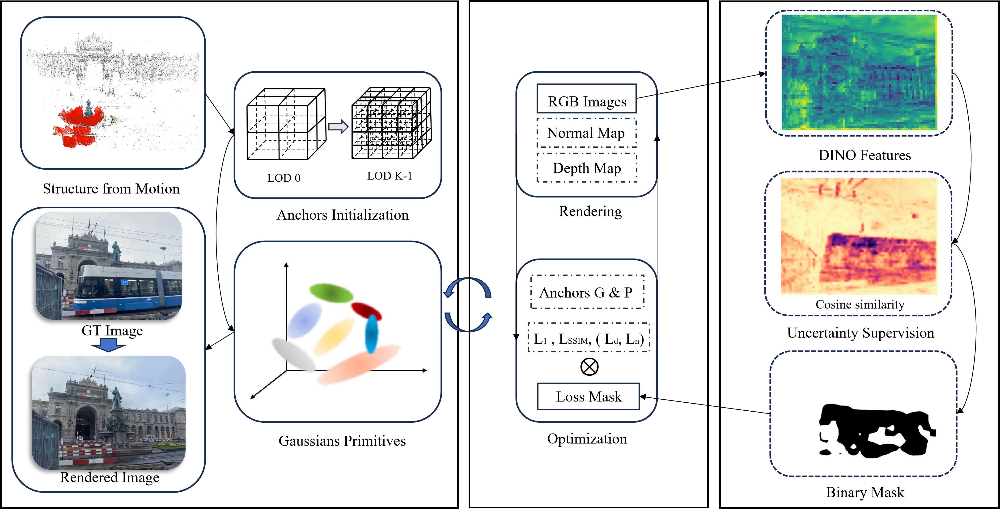

# UH-GS

Official implementation of **UH-GS: Uncertainty-guided Hierarchical Gaussian Splatting for Robust Outdoor Scene Reconstruction**.

## Overview

UH-GS is a robust Gaussian Splatting framework designed for unconstrained outdoor scenes. By leveraging uncertainty estimation and hierarchical optimization, UH-GS effectively suppresses dynamic distractors and improves reconstruction quality under challenging real-world conditions.

  

---

## Qualitative Results

### Comparison with Scaffold-GS

<table>
<tr>
<td align="center">
<b>Scaffold-GS (Patio)</b> 

</td>
  
<td align="center">
<b>UH-GS (Patio)</b> 

</td>
</tr>
</table>

UH-GS effectively suppresses dynamic distractors and unreliable observations, producing cleaner geometry and higher-quality novel-view synthesis than Scaffold-GS in challenging outdoor scenes.

---

## Dataset

We evaluate UH-GS on the following public datasets:

- [Photo Tourism Dataset](https://www.cs.ubc.ca/~kmyi/imw2020/data.html)
- [On-the-Go Dataset](https://rwn17.github.io/nerf-on-the-go/)

Please follow the dataset instructions provided on the corresponding dataset websites for downloading and preprocessing.

## Status

🚧 The code is currently being organized and cleaned for public release.

We will release the source code, pretrained checkpoints, and detailed instructions upon paper acceptance.
