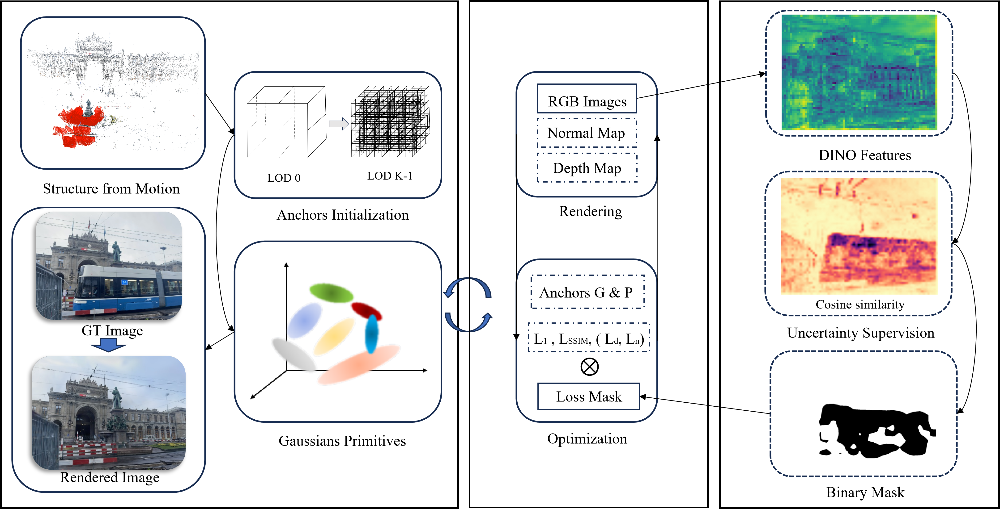

# UH-GS

Official implementation of **UH-GS: Uncertainty-guided Hierarchical Gaussian Splatting for Robust Outdoor Scene Reconstruction**.

## Overview

UH-GS is a robust Gaussian Splatting framework designed for unconstrained outdoor scenes. By leveraging uncertainty estimation and hierarchical optimization, UH-GS effectively suppresses dynamic distractors and improves reconstruction quality under sparse-view and challenging real-world conditions.

<p align="center">
  
</p>

---

## Qualitative Results

### Comparison with Scaffold-GS

<table>
<tr>
<td align="center">
<b>Scaffold-GS (Patio)</b><br>

</td>
  
<td align="center">
<b>UH-GS (Patio)</b><br>

</td>
</tr>
</table>

UH-GS effectively suppresses dynamic distractors and unreliable observations, producing cleaner geometry and higher-quality novel-view synthesis than Scaffold-GS in challenging outdoor scenes.

---

## Installation

```bash
git clone https://github.com/haoran269/UH-GS.git
cd UH-GS

conda create -n uhgs python=3.10
conda activate uhgs

pip install -r requirements.txt
```

## Training

```bash
python train.py -s <dataset_path>
```

## Evaluation

```bash
python render.py -m <model_path>
python metrics.py -m <model_path>
```

## Dataset

We evaluate UH-GS on:

* Photo Tourism Dataset
* On-the-Go Dataset

Please follow the dataset instructions provided in the corresponding benchmark repositories.

## Citation

```bibtex
@article{gao2026uhgs,
  title={UH-GS: Uncertainty-guided Hierarchical Gaussian Splatting for Robust Outdoor Scene Reconstruction},
  author={Gao, Haoran and others},
  journal={...},
  year={2026}
}
```
